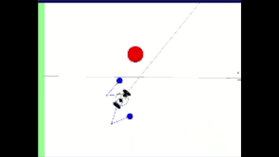
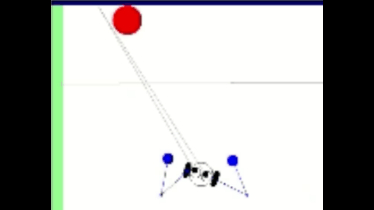
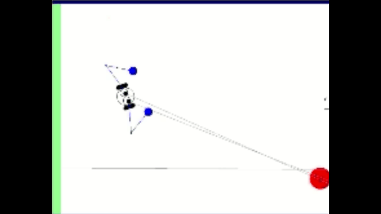

# Robotics Simulation

# Relevant Skills:

- ## Stereo Localization
The robot uses its stereo vision(two eyes) to appoximate the depth of the vision to localize the red ball.\

- ## PD Control
Spring-Mass-Damper, Open/Closed-Loop Control, Laplace Transform, etc.\

- ## Kinematics
Forward and Inverse kinematics\

- ## State Machine
Finite State Machine\
The robot transforms into defensive mode based on the status of the finite state machine.\

## +
- ### Homogeneous Transform
- ### Dynamics
- ### Controls
- ### Path Planning

