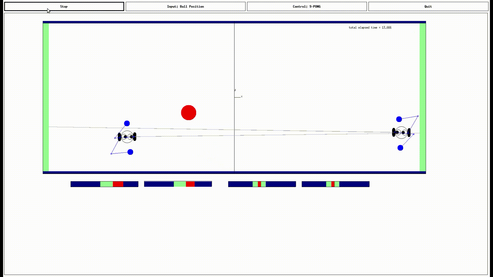

Relevant Skills:
##### Spring-Mass-Damper
##### Open- and Closed-Loop Control
##### PD(Proportional Derivate) Control
##### Laplace Transform
##### Frequency-Domain Response
##### Kinematics
##### Stereo Localization
##### Homogeneous Transform
##### Dynamics
##### Controls
##### Path Planning
##### State Machine

