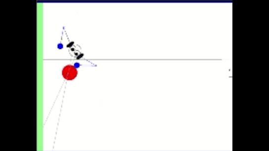

Relevant Skills:

### Stereo Localization

The robot uses its stereo vision(two eyes) to appoximate the depth of the vision to localize the red ball.

#### Spring-Mass-Damper, Open- and Closed-Loop Control, PD(Proportional Derivate) Control, Laplace Transform, etc.
PD control was used 

##### Frequency-Domain Response
##### Kinematics (Forward and Inverse)

##### Homogeneous Transform
##### Dynamics
##### Controls
##### Path Planning
##### State Machine

